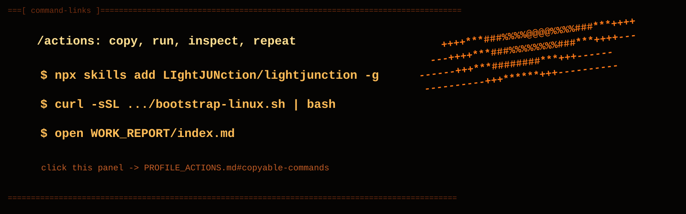

<div align="center">
  <a href="PROFILE_ACTIONS.md#quick-links"></a>
  <a href="PROFILE_ACTIONS.md#live-data"></a>
  <a href="PROFILE_ACTIONS.md#repositories"></a>
  <a href="PROFILE_ACTIONS.md#copyable-commands"></a>
</div>

```
===[ LIghtJUNction ]===========================================================
terminal-first assistant workspace / small verified actions / public facade
==============================================================================
```

**Languages:** English · [中文](README.zh.md) · [Русский](README.ru.md) · [한국어](README.ko.md) · [日本語](README.ja.md)

Animated ASCII-flame profile. Click any panel for links, reports, repositories, and copyable commands.
