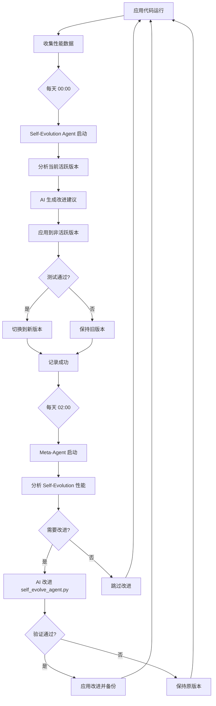

# 🧬 自我进化系统架构 (Self-Evolution System Architecture)

## 概述

这是一个三层自我改进的闭环系统，能够自动优化和进化代码。

## 系统层次结构

```
┌─────────────────────────────────────────────────────────┐
│  🧠 Meta-Agent (元代理)                                  │
│  meta_agent.py [IMMUTABLE - 不可修改]                   │
│  ↓ 基于性能指标改进自我进化脚本                          │
└─────────────────────────────────────────────────────────┘
                           ↓
┌─────────────────────────────────────────────────────────┐
│  🧬 Self-Evolution Agent (自我进化代理)                  │
│  self_evolve_agent.py [可被 Meta-Agent 改进]            │
│  ↓ A/B 测试迭代改进应用代码                             │
└─────────────────────────────────────────────────────────┘
                           ↓
┌─────────────────────────────────────────────────────────┐
│  📝 Application Code (应用代码)                          │
│  *_a.py / *_b.py [可被 Self-Evolution Agent 改进]       │
│  实际执行业务逻辑的代码                                  │
└─────────────────────────────────────────────────────────┘
```

## 核心组件

### 1. 🧠 Meta-Agent (顶层 - 不可修改)

**文件**: `meta_agent.py`  
**工作流**: `.github/workflows/meta_evolve.yml`  
**运行频率**: 每天 02:00 UTC  
**模型**: gpt-4o-mini (免费)

**职责**:
- 监控 self_evolve_agent.py 的性能
- 分析成功率和失败模式
- 使用 AI 改进 self_evolve_agent.py
- 验证并应用改进
- 维护系统完整性

**关键特性**:
- ⚠️ **完全不可修改** - 代码和工作流都标记为 IMMUTABLE
- 闭环反馈 - 基于实际运行结果改进
- 自动备份 - 改进前创建备份
- 完整性验证 - 使用 SHA256 哈希检测未授权修改

**配置文件**: `meta_agent_config.json`
```json
{
  "version": "1.0.0",
  "improvement_count": 0,
  "performance_metrics": [],
  "meta_evolution_history": []
}
```

### 2. 🧬 Self-Evolution Agent (中层 - 可进化)

**文件**: `self_evolve_agent.py`  
**工作流**: `.github/workflows/self_evolve.yml`  
**运行频率**: 每天 00:00 UTC  
**模型**: gpt-4o-mini (免费)

**职责**:
- A/B 迭代改进应用代码
- 分析代码质量和性能
- 应用 AI 建议的改进
- 测试和验证改进
- 在版本 a 和 b 之间切换

**A/B 迭代机制**:
- **第1天**: 改进版本 a，测试通过后激活
- **第2天**: 改进版本 b，测试通过后激活
- **第3天**: 改进版本 a，测试通过后激活
- 循环往复...

**管理的文件对**:
```
process_code_showcase_a.py  ←→  process_code_showcase_b.py
update_readme_data_a.py     ←→  update_readme_data_b.py
process_qa_a.py             ←→  process_qa_b.py
```

**配置文件**: `agent_config.json`
```json
{
  "current_version": "a",
  "files": {
    "process_code_showcase": {
      "a": "process_code_showcase_a.py",
      "b": "process_code_showcase_b.py",
      "active": "a"
    }
  },
  "evolution_history": []
}
```

### 3. 📝 Application Code (底层 - A/B版本)

**文件**: `*_a.py` 和 `*_b.py`  
**更新方式**: 由 self_evolve_agent.py 自动改进

**初始状态**: 两个版本完全相同  
**进化过程**: 每天交替改进一个版本  
**激活逻辑**: 测试通过后切换到新改进的版本

## 工作流程

### 完整的进化周期



### 日常运行时间表

| 时间 (UTC) | 活动 | 说明 |
|-----------|------|------|
| 00:00 | 🧬 Self-Evolution | 改进应用代码 (A/B测试) |
| 02:00 | 🧠 Meta-Evolution | 改进自我进化脚本 |

## 技术栈

- **AI 框架**: openai-agents (官方 SDK)
- **模型**: gpt-4o-mini (免费层级)
- **语言**: Python 3.12
- **依赖管理**: uv
- **CI/CD**: GitHub Actions
- **API**: GitHub Models API (Azure)

## 安全特性

### Meta-Agent 不可变性

1. **代码标记**: 文件头部明确标注 IMMUTABLE
2. **哈希验证**: 运行时检查 SHA256 哈希
3. **工作流保护**: 工作流文件包含多重警告
4. **版本锁定**: Version 1.0.0-IMMUTABLE-FINAL

### 自我进化安全

1. **隔离测试**: 改进前先测试
2. **自动备份**: 应用改进前创建备份
3. **回滚机制**: 测试失败自动恢复
4. **完整性检查**: 语法和结构验证

## 性能指标

### Self-Evolution Agent 跟踪

- 成功率 (Success Rate)
- 常见失败模式 (Common Failures)
- 处理的文件数 (Files Processed)
- 改进周期数 (Evolution Cycles)

### Meta-Agent 跟踪

- 系统改进次数 (Improvements Made)
- Self-Evolution 性能趋势
- 改进前后对比

## 使用指南

### 手动触发 Self-Evolution

```bash
# 通过 GitHub Actions 界面
Actions → 🧬 Self-Evolving Agent → Run workflow

# 或本地运行
python self_evolve_agent.py
```

### 手动触发 Meta-Evolution

```bash
# 通过 GitHub Actions 界面  
Actions → 🧠 Meta-Agent Evolution → Run workflow

# 或本地运行 (需要 openai-agents)
python meta_agent.py
```

### 查看进化历史

```bash
# Self-Evolution 历史
cat agent_config.json | jq '.evolution_history'

# Meta-Evolution 历史
cat meta_agent_config.json | jq '.meta_evolution_history'
```

### 检查当前激活版本

```bash
python -c "import json; config = json.load(open('agent_config.json')); print(f\"Active: {config['current_version']}\")"
```

## 配置文件说明

### agent_config.json
```json
{
  "version": "1.0.0",
  "iteration_cycle": "ab",           // A/B 迭代模式
  "current_version": "a",            // 当前激活版本
  "files": {                         // 管理的文件对
    "process_code_showcase": {
      "a": "process_code_showcase_a.py",
      "b": "process_code_showcase_b.py",
      "active": "a"
    }
  },
  "evolution_history": [],           // 进化记录
  "model": "gpt-4o-mini"
}
```

### meta_agent_config.json
```json
{
  "version": "1.0.0",
  "improvement_count": 0,            // 改进次数
  "performance_metrics": [],         // 性能指标历史
  "meta_evolution_history": [],      // 元进化记录
  "immutable_hash": "..."            // 完整性哈希
}
```

## 故障排除

### Self-Evolution 失败

1. 检查 `evolution_log.txt`
2. 查看 `agent_config.json` 中的失败原因
3. 手动运行 `python self_evolve_agent.py` 调试

### Meta-Evolution 失败

1. 检查 `meta_evolution_log.txt`
2. 验证 self_evolve_agent.py 语法
3. 检查备份文件 `self_evolve_agent.py.backup.*`

### API 限制

如果遇到 API 速率限制:
- GitHub Models API 有免费配额限制
- 可以调整 cron 时间减少频率
- 或升级到付费 API 端点

## 最佳实践

### ✅ 应该做的

- 定期检查进化历史和性能指标
- 监控成功率，确保系统正常运行
- 保留备份文件以便必要时恢复
- 通过 issue 跟踪系统行为

### ❌ 不应该做的

- **绝对不要修改 meta_agent.py**
- **绝对不要修改 .github/workflows/meta_evolve.yml**
- 不要手动编辑 agent_config.json (除非调试)
- 不要删除备份文件

## 系统优势

1. **完全自动化**: 无需人工干预
2. **持续改进**: 基于实际运行数据优化
3. **容错能力**: 失败自动回滚
4. **透明可观测**: 完整的历史记录
5. **零成本**: 使用免费 AI 模型

## 未来扩展

- 支持更多语言的代码进化
- 添加性能基准测试
- 引入多目标优化
- 集成更多 AI 模型
- 添加可视化仪表板

## 许可和贡献

这是一个实验性的自我进化系统。欢迎提出建议，但请注意:
- 不要修改核心不可变组件
- 可以扩展应用代码
- 可以添加新的文件对到进化系统

---

**创建日期**: 2025-11-03  
**版本**: 1.0.0  
**作者**: LIghtJUNction & AI  
**状态**: 🚀 生产就绪
